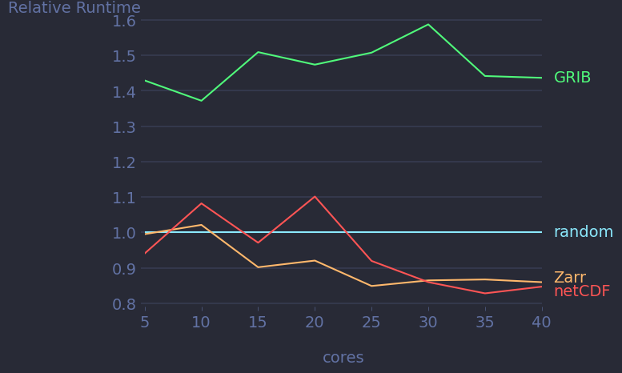

Experiment Examples
===================

In this chapter we will setup and run a few experiments.
Some comments on how to interpret the results will be provided.
We will use the :mod:`finch.brn` operator throughout this chapter for our experiments.

Input Format
------------

Let's see how different input formats have an effect on the runtime of the BRN operator.

First we need to create new input version for the different input formats.
The BRN input source reads from a GRIB file, or generates random data, depending on which format was requested.
So we will need to add a new input version for NetCDF and for Zarr.

Let's run `finch` with the following two configs.

.. code-block:: yaml

    brn:
        input_management:
            run: false
            add_version: !config:Version
            format: "zarr"
            dim_order: "zyx"
            coords: true
            chunks:
                x: -1
                y: -1
                z: 1

        runtime_measurement:
            run: false

        evaluation:
            run: true

.. code-block:: yaml

    brn:
        input_management:
            run: false
            add_version: !config:Version
            format: "netcdf"
            dim_order: "zyx"
            coords: true
            chunks:
                x: -1
                y: -1
                z: 1

        runtime_measurement:
            run: false

        evaluation:
            run: true

.. hint:: You can run finch with a custom config with the following command

    .. code-block:: bash

        finch -c config.yaml

    Where `config.yaml` is the path to your configuration file.

    Alternatively, you can write your configuration in a file called `finch_run_config.yaml` in your current working directory and run `finch` without arguments.

Running finch with the above two configurations will create two new versions in the `brn` directory in the finch input store.

.. hint:: The finch input store is by default located at `$SCRATCH/finch_store`.

Now we are ready to run our experiment.
Run `finch` with the following configuration.

.. code-block:: yaml

    brn:

        runtime_measurement:
            run: true
            exp_name: "data_format"

            run_configs: !config:Run
                workers: [5, 10, 15, 20, 25, 30, 35, 40]
                impl: "brn.brn_xr"
                input_version: !config:Version
                    format: ["grib", "netcdf", "zarr", "fake"]
                    dim_order: "zyx"
                    coords: true
                    chunks:
                        x: -1
                        y: -1
                        z: 1

        evaluation:
            run: true
            exp_name: null
            runtimes_plot:
                - no_inp_loading
            main_dim: &main_dim input_version_format
            speedup_dims:
              - cores
            estimate_serial: false
            rename_labels:
                Format.NETCDF: netCDF
                Format.FAKE: random
                Format.GRIB: GRIB
                Format.ZARR: Zarr
            reference_labels:
                cores: random

.. tip:: While running the experiment (after the dask cluster was loaded, which happens after the progress bar appears), you can access the dask dashboard to get some insights in what is going on behind the scenes.
    The dashboard is available on localhost at port 8877 by default (http://localhost:8877).
    If this port is already in use, dask will use some other random port and will print a warning telling you about the port it actually is using.

The above configuration will setup an experiment where the different input formats will be compared against each other for different numbers of workers.
By default, every worker has one dedicated core.
Setting the number of workers therefore gives us direct control over the number of cores which dask will use.

The above config will create three plots in the directory `$SCRATCH/finch_eval/brn_data_format/plots`:

- A scalability plot called `cores_no_inp_loading_speedup.png`
- A relative runtime plot called `cores_no_inp_loading.png`
- A runtime composition plot called `runtime_parts.png`

The most interesting plot of these three is probably the relative runtime plot, which looks like this.

Some remarks should be made about the generated plots:

-   Runtimes don't include the preparation time for the input loading.

    For loading GRIB files we use the cfgrib backend of Xarray.
    Unfortunately, cfgrib imposes a massive serial overhead, which is captured in the `input_loading` part of the runtime.
    By removing this, we can focus better on the parallel runtime of our experiment.

-   The data will be loaded into memory during our warmup rounds.
    Because of dask's caching mechanism, you should expect the data for later iterations to already be in cache and therefore the data loading is not recorded in our runtime.
    We disable caching for future computations.
    However, disabling caching for input loading is currently difficult because of an `open issue <https://github.com/dask/dask/issues/9621>`_ in dask.

-   The relative runtime plot shows runtimes relative to the runtime when randomly generating data.
    We create a relative runtime plot instead of an absolute runtime plot in order to be able to properly compare the runtimes for all number of cores.
    Note that the absolute runtime still decreases with increasing core counts, as you can see on the scalability plot.