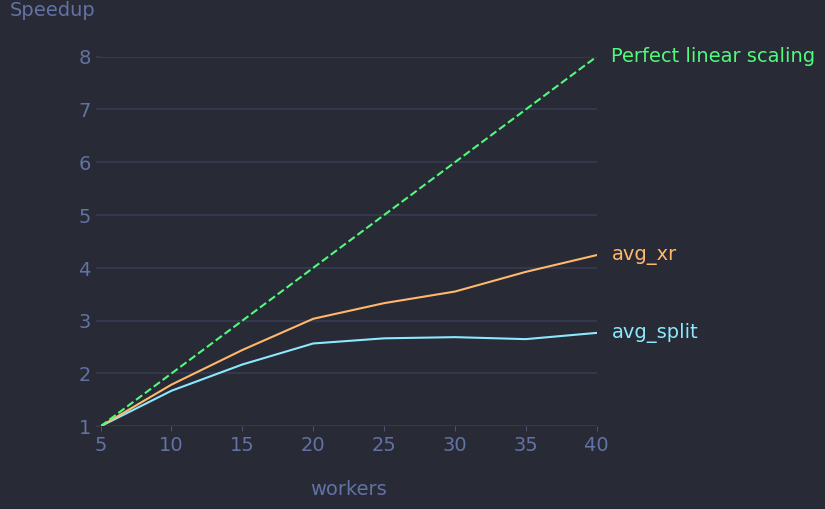

First Steps
===========

In this chapter we will go through the process of creating a new operator and running and evaluating experiments on it.
We will incrementally create a small experiment script. The full script can be found :ref:`below <ops-full-script>`.
If you want to add your operator to the built-in operators of finch, make sure to read :ref:`new_builtin_ops`.

Implementing an Operator
------------------------

Finch defines a default function signature for operators: :py:attr:`finch.DefaultOperator`
An operator conforming to the default signature takes a single ``xarray.Dataset`` and returns a ``xarray.DataArray``.
Additional optional arguments after the dataset are allowed.

.. note::
    In principle, it is also possible to write operators which follow a custom signature.
    Finch is designed in a modular fashion and the core functionalities are generally independent of the operator signature.
    However, these core functions require operator specific arguments, which are already implemented in finch for the default operator signature.
    If you require a different signature, you will need to implement these arguments yourself.

As a running example, let's implement an averaging operator. ::

    def avg_xr(data: xr.Dataset, array="A", dim="x") -> xr.DataArray:
        return data[array].mean(dim)

This operator conforms to the default signature: The first (and only) required argument is a dataset, and it returns a data array.

Let's write a second implementation of the operator. ::

    def avg_split(data: xr.Dataset, array="A", dim="x") -> xr.DataArray:
        dim_len = data[array].sizes[dim]
        part1 = data[array].isel({dim: slice(0, dim_len // 2)})
        part2 = data[array].isel({dim: slice(dim_len // 2, None)})
        return (part1.mean(dim) + part2.mean(dim)) / 2

Note that the two operator implementations have the exact same signature.
This is a requirement when implementing multiple operator versions.
Additionally, it is a good custom to stick to a specific naming pattern when naming the operators.
In this example, the naming pattern is ``"avg_.*"``.

.. tip::
    Instead of creating a custom operator, you can also run your experiment on a built-in operator.
    In this case you would need to define your input according to the needs of the operator you selected.
    See :ref:`ops_api` for a list of built-in operators.

Defining Inputs
---------------

.. attention:: Finch's input management relies on the default operator signature. If you use a custom input format for your operator, you need to implement your own input management system.

Finch provides its own input management.
This allows a user to easily setup new input versions.
For example, a user might want to see how his operator performs on both GRIB and NetCDF input files and compare the performance of his operator when using the two different file formats.
Input management is documented in detail in :ref:`input-management`.

In finch, an input is an object, which contains data for an experiment run.
An input can have different versions, which describe how the data is provided.
An operator can use different inputs for different experiments.
You create a new input from the class :py:class:`finch.data.Input` ::

    avg_input = finch.data.Input(
        name="average",
        source=avg_source,
        source_version=avg_src_version
    )

The data of an input is provided by its source, which needs to be provided when creating a new input.
The source describes how the data of the input is loaded initially.
You can easily create new versions of an input and store them to disk with finch.
Finch will query the available versions of an input when a specific version is requested and can create a new version on the fly.

A source is simply a function which takes a :py:class:`finch.data.Input.Version` object and returns a ``xarray.Dataset``.
For our example, let's create some random input. ::

    def avg_source(version: finch.data.Input.Version) -> xr.Dataset:
        chunks = (version.chunks.get("x", -1), version.chunks.get("y", 100))
        dask_array = da.random.random((10_000, 100_000), chunks=chunks)
        array = xr.DataArray(dask_array, dims=("x", "y"))
        return array.to_dataset(name="A")

The :py:class:`finch.data.Input.Version` argument indicates, which version of the input was requested.
In principle, finch will ensure itself that the requested version will be returned.
However, it is often more efficient to directly load the source in a specific format than to later on reformat it (especially for chunking).

Along with the source, you need to provide a source version to the constructor of :py:class:`finch.data.Input`.
The source version fully describes the source data, which is returned by default from the source.
It must be complete, i.e. no fields are allowed to be ``None``. ::

    avg_src_version = finch.data.Input.Version(
        format=finch.data.Format.FAKE,
        dim_order="xy",
        chunks={"x": -1, "y": 100},
        coords=True,
    )

Running and Evaluating Experiments
----------------------------------

We can now run experiments on our operators.
Let's compare how well the two operators scale.
We can use :py:func:`finch.measure_runtimes` to measure the runtimes of our operators. ::

    runtimes = finch.measure_runtimes(run_configs)

The :py:func:`finch.measure_runtimes` function requires a list of :py:class:`finch.RunConfig` objects, which defines our experiment configuration.
For standard operators, we can use the specialized class :py:class:`finch.OperatorRunConfig`.
Let's use dask with a single core per worker and go up to 40 cores. ::

    run_configs = finch.OperatorRunConfig.list_configs(
        impl=[avg_xr, avg_split],
        cluster_config=finch.scheduler.ClusterConfig(cores_per_worker=1),
        workers=list(range(5, 45, 5)),
        input_obj=avg_input,
        input_version=avg_src_version,
        iterations=5,
    )

Our output ``runtimes`` is now a list of raw :py:class:`finch.experiments.Runtime` objects (actually :py:class:`finch.experiments.DaskRuntime`).
We could inspect them manually, but finch provides some features for evaluation.
For this purpose, we can first transform our runtime objects into a "result dataset". ::

    results = finch.eval.create_result_dataset(
        runtimes,
        run_configs,
        experiment_name="avg_scaling"
    )

The result dataset captures our runtimes along with our experiment configurations inside a single object.
It can be used as an input for the different evaluation function of the :py:mod:`finch.eval` module.

Let's create a plot which compares the scalability of our two operators. ::

    finch.eval.create_plots(
        results,
        scaling_dims=["workers"],
        estimate_serial=False,
        runtime_selection=["full"]
    )

The :py:func:`finch.eval.create_plots` function creates a plot per configuration attribute, for which we have selected more than a single value.
In our case, this is only the "workers" attribute, for which we ask the function to create a scalability plot.
With ``estimate_serial=False`` we disable serial overhead analysis.
The ``runtime_selection`` lets us control which parts of the runtime we want to plot. Finch can record different runtimes for the experiment, such as input loading, dask preparations, etc.
In our example, we are however only interested in the full runtime.

Let's run our script with python on SLURM. ::

    srun python experiment.py

Our plots will be saved inside the :confval:`plot_dir` directory.
We will find there a scalability plot and a runtime plot for our runtime.
The scalability plot should look something like this.

.. tip:: While running your experiments, you can get live diagnostics from the dask dashboard, which you'll find by default at http://localhost:8877

.. _ops-full-script:

Full Script
-----------

::

    #!/usr/bin/env python3

    import dask.array as da
    import xarray as xr

    import finch

    # Operator definition

    def avg_xr(data: xr.Dataset, array="A", dim="x") -> xr.DataArray:
        return data[array].mean(dim)

    def avg_split(data: xr.Dataset, array="A", dim="x") -> xr.DataArray:
        dim_len = data[array].sizes[dim]
        part1 = data[array].isel({dim: slice(0, dim_len // 2)})
        part2 = data[array].isel({dim: slice(dim_len // 2, None)})
        return (part1.mean(dim) + part2.mean(dim)) / 2

    # Input management

    avg_src_version = finch.data.Input.Version(
        format=finch.data.Format.FAKE,
        dim_order="xy",
        chunks={"x": -1, "y": 100},
        coords=True,
    )

    def avg_source(version: finch.data.Input.Version) -> xr.Dataset:
        chunks = (version.chunks.get("x", -1), version.chunks.get("y", -1))
        state = da.random.RandomState(1234)
        dask_array = state.random((10_000, 100_000), chunks=chunks)
        array = xr.DataArray(dask_array, dims=("x", "y"))
        return array.to_dataset(name="A")

    avg_input = finch.data.Input(
        name="average",
        source=avg_source,
        source_version=avg_src_version
    )

    # Run experiments

    run_configs = finch.OperatorRunConfig.list_configs(
        impl=[avg_xr, avg_split],
        cluster_config=finch.scheduler.ClusterConfig(cores_per_worker=1),
        workers=list(range(5, 45, 5)),
        input_obj=avg_input,
        input_version=avg_src_version,
        iterations=5,
    )

    runtimes = finch.measure_runtimes(run_configs)

    # Evaluation

    results = finch.eval.create_result_dataset(
        runtimes,
        run_configs,
        experiment_name="avg_scaling"
    )

    finch.eval.create_plots(
        results,
        scaling_dims=["workers"],
        estimate_serial=False,
        runtime_selection=["full"]
    )
